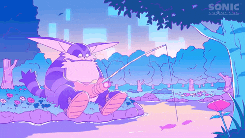

    

# -- Welcome to my Github profile! --

----------------------------------------------

B.Day: 09/13 

My nationality: Brazilian

I'm a VGM composer, Modder, Coder and Artist

Founder of Chaotix Crew' and Dousky Team

----------------------------------------------

My recent work includes Projects from college like:
*   [Queimada Crash](https://github.com/DexDousky/APS-jogo-das-queimadas)
*   [Python Encrypt Menssager](https://github.com/DexDousky/python_rip.pynthao)

And My Friday Night Funkin' Mods from 2021 - 2024 on GameBanana:

*   [Dousky Collection](https://gamebanana.com/mods/422331)
*   [Versus Dex Dousky v1 and v2](https://gamebanana.com/mods/468489)

I also had a lil' hand on other mods like:

*   [Vs Espe](https://especulamente.com.br/projetos/46)
*   [Summer Break Special](https://gamebanana.com/mods/534099)
*   [FNF: Stickman with a Screwdriver ](https://gamebanana.com/mods/411552)
*   [Bonely's Rhythm](https://gamebanana.com/mods/535787)

