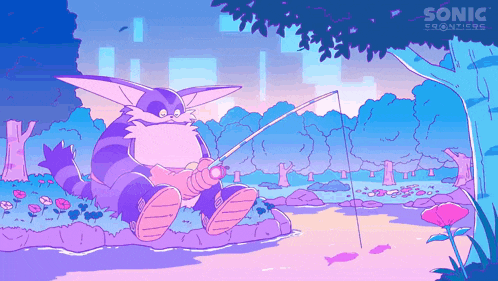

  

<h1 align="center">👋 Welcome to my GitHub profile!</h1>

---

## 👤 Sobre mim

- 🎂 **Aniversário:** 13 de setembro  
- 🇧🇷 **Nacionalidade:** Brasileiro  
- 🎵 **Compositor VGM** | 🛠️ Modder | 💻 Programador | 🎨 Artista  
- 👥 Fundador da **Chaotix Crew'** e **Dousky Team**

---

## 🌐 Onde me encontrar

  
  
  
  

---

## 🛠️ Habilidades

**Linguagens e ferramentas que utilizo:**

---

## 📁 Projetos em destaque

### Faculdade / Estudos

- [**Queimada Crash**](https://github.com/DexDousky/APS-jogo-das-queimadas) – Jogo desenvolvido para APS.
- [**Python Encrypt Messenger**](https://github.com/DexDousky/python_rip.pynthao) – Mensageiro com criptografia em Python.

### Mods para Friday Night Funkin' (2021–2024)

- [**Dousky Collection**](https://gamebanana.com/mods/422331) – Compilado de minhas criações.
- [**Versus Dex Dousky v1 e v2**](https://gamebanana.com/mods/468489) – Mods focados no meu personagem.

### Colaborações em mods

- [Vs Espe](https://especulamente.com.br/projetos/46)  
- [Summer Break Special](https://gamebanana.com/mods/534099)  
- [FNF: Stickman with a Screwdriver](https://gamebanana.com/mods/411552)  
- [Bonely's Rhythm](https://gamebanana.com/mods/535787)

---

⭐ **Obrigado pela visita!** Sinta-se à vontade para explorar meus repositórios e entrar em contato.
